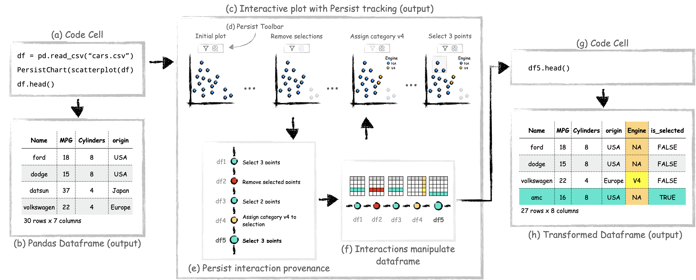

# Persist Examples + Study Results

[](https://mybinder.org/v2/gh/visdesignlab/persist_examples/main?labpath=Tutorial.ipynb)

## **Persist** - Persistent and Reusable Interactions in Computational Notebooks

### Install

This repository contains example notebooks for the [persist](https://github.com/visdesignlab/persist) library. ## Install
To use the extension you will need Python (>=3.8), Vega-Altair (>= 5) and JupyterLab 4. You can install the extension directly from pip using:
```bash
pip install persist_ext
```

You can also setup the complete environment by running the following in your terminal:
```bash
pip install -r requirements.txt
```

After installation is successful, you can start Jupyter Lab as usual by running the command in this directory:
```bash
jupyter lab
```

If your notebook server was already running, you should refresh the browser tab showing the jupyter notebook and restart the kernel.

### Uninstall

To remove the extension, execute:

```bash
pip uninstall persist_ext
```

## Repository Structure

```
persist_examples/
├─ study/ 
│  ├─ (Reference Solution) Study Data I - Avalanches in Utah/
│  ├─ (Reference Solution) Study Data II - Video Games/ 
│  ├─ analysis/ # Analysis results with a notebook analysing results 
│  ├─ P1/ ... P11/
├─ Example_Gallery.ipynb
├─ Tutorial.ipynb
├─ walkthrough.ipynb
```

[Tutorial.ipynb](https://mybinder.org/v2/gh/visdesignlab/persist_examples/main?labpath=Tutorial.ipynb) contains an overview on how to use the Persist extension

[Example_Gallery.ipynb](https://mybinder.org/v2/gh/visdesignlab/persist_examples/main?labpath=Altair_Example_Gallery.ipynb) shows Persist extension with the PersistTable and varioud Vega-Altair charts.

[walkthrough.ipynb](https://mybinder.org/v2/gh/visdesignlab/persist_examples/main?labpath=walkthrough.ipynb) is the notebook which follows the analysis described in the paper.

`study` folder contains artifacts of the user study. The reference solution folders contain datasets and notebooks with tasks completed using Persist as well as Pandas.

The `study/analysis` folder has data collected from the study including participant performance, pre and post study survey, tlx survey scores, and reproducibility of the participant notebooks. [Study_Data_Analysis](https://mybinder.org/v2/gh/visdesignlab/persist_examples/main?labpath=study%2Fanalysis%2FStudy_Data_Analysis.ipynb) walks us through analysis of the study data.

## Extension

Persist is a JupyterLab extension to enable persistent interactive visualizations in JupyterLab notebooks.

https://github.com/visdesignlab/persist/assets/14944083/c6a9347b-7c93-4d0d-9e60-e10707578327

[Watch on Youtube with CC](https://www.youtube.com/watch?v=DXHXPvRHN9I)

### Publication
Persist is developed as part of a [publication](https://osf.io/preprints/osf/9x8eq) and is currently under review.




#### Abstract
> Computational notebooks, such as Jupyter, support rich data visualization. However, even when visualizations in notebooks  are interactive, they still are a dead end: Interactive data manipulations, such as selections, applying labels, filters, categorizations, or fixes to column or cell values, could be efficiently apply in interactive visual components, but interactive components typically cannot manipulate Python data structures. Furthermore, actions performed in interactive plots are volatile, i.e., they are lost as soon as the cell is re-run, prohibiting reusability and reproducibility. To remedy this, we introduce Persist, a family of techniques to capture and apply interaction provenance to enable persistence of interactions. When interactions manipulate data, we make the transformed data available in dataframes that can be accessed in downstream code cells. We implement our approach as a JupyterLab extension that supports tracking interactions in Vega-Altair plots and in a data table view. Persist can re-execute the interaction provenance when a notebook or a cell is re-executed enabling reproducibility and re-use.  
> 
> We evaluated Persist in a user study targeting data manipulations with 11 participants skilled in Python and Pandas, comparing it to traditional code-based approaches. Participants were consistently faster with Persist, were able to correctly complete more tasks, and expressed a strong preference for Persist. 


### Persist and Vega-Altair charts

Persist works with Vega-Altair charts directly for the most part. Vega-Altair and Vega-Lite offer multiple ways to write a specification. However Persist has certain requirements that need to be fulfilled.

- The selection parameters in the chart should be named. Vega-Altair's default behavior is to generate a name of selection parameter with auto-incremented numeric suffix. The value of the generated selection parameter keeps incrementing on subsequent re-executions of the cell. Persist relies on consistent names to replay the interactions, and passing the name parameter fixes allows Persist to work reliably.

- The point selections should have at least the fields attribute specified. Vega-Altair supports selections without fields by using the auto-generated indices to define selections. The indices are generated with the default order of rows in the source dataset. Using the indices directly for selection can cause Persist to operate on incorrect rows if the source dataset order changes.

- Dealing with datetime in Pandas is challenging. To standardize the way datetime conversion takes place within VegaLite and within Pandas when using Vega-Altair, the TimeUnit transforms and encodings must be specified in UTC. e.g `month(Date)` should be `utcmonth(Date)`.


## Source code

Source code for the Persist extension is hosted [here](https://github.com/visdesignlab/persist).